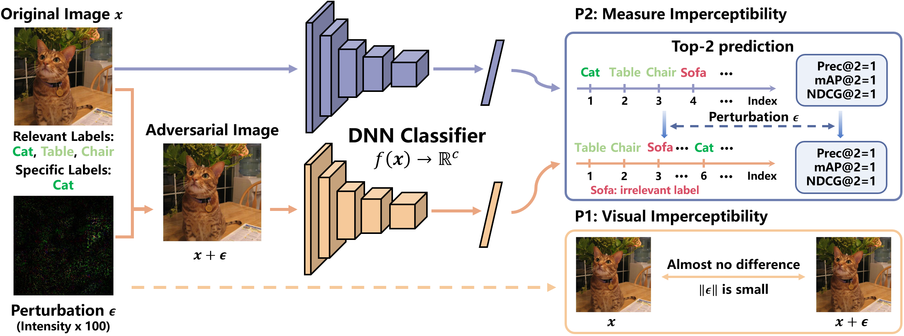

# When Measures are Unreliable: Imperceptible Adversarial Perturbations toward Top-$k$ Multi-Label Learning
Yuchen Sun, Qianqian Xu, Zitai Wang, and Qingming Huang
_________________

This repository is the official implementation of our paper "When Measures are Unreliable: Imperceptible Adversarial Perturbations toward Top-$k$ Multi-Label Learning", which has been accepted by **ACM Conference on Multimedia (ACM MM), 2023**.

## Overview




## Notification

Note that if you get the value of 'Pert' from our code, you should use 'Pert'*255 to get the final perturbation size. 

## Requirements

To install requirements:

```setup
pip install -r requirements.txt
```

## How to run our codes

### 1. Training of the baseline models(inception_v3 and ResNet)
```python
python3 main_attack.py --device-id <device-id> --app train --dataset VOC2012 --num_classes 20 --arch resnet50 --lr 1e-4 --batch-size 32 --image_size 300 --normalize mean_std --results models_NUSWIDE
python3 main_attack.py --device-id <device-id> --app train --dataset COCO2014 --num_classes 80 --arch resnet101 --lr 1e-4 --batch-size 128 --image_size 448 --normalize mean_std --results models_NUSWIDE
python3 main_attack.py --device-id <device-id> --app train --dataset NUSWIDE --num_classes 81 --arch resnet101 --lr 1e-4 --batch-size 64 --image_size 224 --normalize mean_std --results models_NUSWIDE
```
### 2. Untargeted attacks

#### - To run T$_k$MIA attack
##### For PACAL VOC 2012
```python
python main_attack.py --app global_specific_attack --lr_attack 5e-4 --device-id <device-id> --model_path resnet50_300_32_0.0001_SGD_2023-03-14_05-05-25 --arch resnet50 --specific_index 0,1,3,5,6,13,18 --maxiter 300 --k_value 3
python main_attack.py --app random_specific_attack --lr_attack 5e-4 --device-id <device-id> --model_path resnet50_300_32_0.0001_SGD_2023-03-14_05-05-25 --arch resnet50 --maxiter 300 --k_value 2 --n_pert 2 --del_n 2
```

##### For MS COCO 2014
```python
python main_attack.py --app global_specific_attack --lr_attack 1e-3 --device-id <device-id> --dataset COCO2014 --arch resnet101 --results models_COCO2014 --model_path resnet101_448_128_1e-4_Adam --num_classes 80 --image_size 448 --specific_index 62,63,64,65,66,67,68,69,70,72,78 --maxiter 300 --k_value 5
python main_attack.py --app random_specific_attack --lr_attack 5e-4 --device-id <device-id> --dataset COCO2014 --arch resnet101 --results models_COCO2014 --model_path resnet101_448_128_1e-4_Adam --num_classes 80 --image_size 448 --maxiter 300 --k_value 5 --n_pert 3 --del_n 2
```

**For NUS WIDE 2014**

```python
python main_attack.py --app global_specific_attack --lr_attack 1e-3 --device-id <device-id> --dataset NUSWIDE --arch resnet101 --results models_NUSWIDE --model_path resnet101_224_64_0.0001_Adam_mean_std_2023-04-02_09-22-51 --num_classes 81 --image_size 224 --specific_index 0,7,10,14,23,25,46,47,48,51,58,68,76 --maxiter 300 --k_value 3 --weight_decay 1e-3
python main_attack.py --app random_specific_attack --lr_attack 5e-4 --device-id <device-id> --dataset NUSWIDE --arch resnet101 --results models_NUSWIDE --model_path resnet101_224_64_0.0001_Adam_mean_std_2023-04-02_09-22-51 --num_classes 81 --image_size 224 --maxiter 300 --k_value 5 --n_pert 3 --del_n 2
```

#### - To run T$_k$ML-AP-U attack
#####  For PACAL VOC 2012
```python
python main_attack.py --app none_target_attack_global --lr_attack 5e-4 --device-id <device-id> --model_path resnet50_300_32_0.0001_SGD_2023-03-14_05-05-25 --arch resnet50 --specific_index 4,8,10,15,17,19 --maxiter 300 --k_value 3
python main_attack.py --app none_target_attack_random --lr_attack 5e-4 --device-id <device-id> --model_path resnet50_300_32_0.0001_SGD_2023-03-14_05-05-25 --arch resnet50 --maxiter 300 --k_value 2 --n_pert 2 --del_n 2
```

#####  For MS COCO 2014
```python
python main_attack.py --app none_target_attack_global --lr_attack 1e-3 --device-id <device-id> --dataset COCO2014 --arch resnet101 --results models_COCO2014 --model_path resnet101_448_128_1e-4_Adam --num_classes 80 --image_size 448 --specific_index 24,25,26,27,28,73,74,75,76,77,79 --maxiter 100 --k_value 3
python main_attack.py --app none_target_attack_random --lr_attack 1e-3 --device-id <device-id> --dataset COCO2014 --arch resnet101 --results models_COCO2014 --model_path resnet101_448_128_1e-4_Adam --num_classes 80 --image_size 448 --maxiter 500 --k_value 3 --n_pert 3 --del_n 3
```

#####  For NUS WIDE 2014
```python
python main_attack.py --app none_target_attack_global --lr_attack 1e-3 --device-id <device-id> --dataset NUSWIDE --arch resnet101 --results models_NUSWIDE --model_path resnet101_224_64_0.0001_Adam_mean_std_2023-04-02_09-22-51 --num_classes 81 --image_size 224 --specific_index 3,4,5,20,22,26,30,31,38,40,41,59,60,64,65,66,69,70,72,75,78 --maxiter 300 --k_value 3
python main_attack.py --app none_target_attack_random --lr_attack 1e-3 --device-id <device-id> --dataset NUSWIDE --arch resnet101 --results models_NUSWIDE --model_path resnet101_224_64_0.0001_Adam_mean_std_2023-04-02_09-22-51 --num_classes 81 --image_size 224 --maxiter 500 --k_value 5 --n_pert 3 --del_n 2
```

#### - To run $k$Fool attack

##### For PACAL VOC 2012

```python
python main_attack.py --app baseline_kfool_global --lr_attack 5e-4 --device-id <device-id> --model_path resnet50_300_32_0.0001_SGD_2023-03-14_05-05-25 --arch resnet50 --specific_index 4,8,10,15,17,19 --maxiter 300 --k_value 3
python main_attack.py --app baseline_kfool_random --lr_attack 5e-4 --device-id <device-id> --model_path resnet50_300_32_0.0001_SGD_2023-03-14_05-05-25 --arch resnet50 --maxiter 300 --k_value 2 --n_pert 2 --del_n 2
```

**For MS COCO 2014**

```python
python main_attack.py --app baseline_kfool_global --lr_attack 1e-3 --device-id <device-id> --dataset COCO2014 --arch resnet101 --results models_COCO2014 --model_path resnet101_448_128_1e-4_Adam --num_classes 80 --image_size 448 --specific_index 24,25,26,27,28,73,74,75,76,77,79 --maxiter 100 --k_value 3
python main_attack.py --app baseline_kfool_random --lr_attack 1e-3 --device-id <device-id> --dataset COCO2014 --arch resnet101 --results models_COCO2014 --model_path resnet101_448_128_1e-4_Adam --num_classes 80 --image_size 448 --maxiter 100 --k_value 10 --n_pert 2 --del_n 2
```

**For NUS WIDE 2014**

```python
python main_attack.py --app baseline_kfool_global --lr_attack 1e-3 --device-id <device-id> --dataset NUSWIDE --arch resnet101 --results models_NUSWIDE --model_path resnet101_224_64_0.0001_Adam_mean_std_2023-04-02_09-22-51 --num_classes 81 --image_size 224 --specific_index 3,4,5,20,22,26,30,31,38,40,41,59,60,64,65,66,69,70,72,75,78 --maxiter 300 --k_value 3
python main_attack.py --app baseline_kfool_random --lr_attack 1e-3 --device-id <device-id> --dataset NUSWIDE --arch resnet101 --results models_NUSWIDE --model_path resnet101_224_64_0.0001_Adam_mean_std_2023-04-02_09-22-51 --num_classes 81 --image_size 224 --maxiter 300 --k_value 5 --n_pert 3 --del_n 2
```

#### - To run ML-CW-U attack

##### For PACAL VOC 2012

```python
python main_attack.py --app baseline_rank_global --lr_attack 5e-4 --device-id <device-id> --model_path resnet50_300_32_0.0001_SGD_2023-03-14_05-05-25 --arch resnet50 --specific_index 14 --maxiter 300 --k_value 2
python main_attack.py --app baseline_rank_random --lr_attack 5e-4 --device-id <device-id> --model_path resnet50_300_32_0.0001_SGD_2023-03-14_05-05-25 --arch resnet50 --maxiter 300 --del_n 2 --k_value 3 --n_pert 2
```

**For MS COCO 2014**

```python
python main_attack.py --app baseline_rank_global --lr_attack 1e-3 --device-id <device-id> --dataset COCO2014 --arch resnet101 --results models_COCO2014 --model_path resnet101_448_128_1e-4_Adam --num_classes 80 --image_size 448 --specific_index 62,63,64,65,66,67,68,69,70,72,78 --maxiter 300 --k_value 5
python main_attack.py --app baseline_rank_random --lr_attack 1e-3 --device-id <device-id> --dataset COCO2014 --arch resnet101 --results models_COCO2014 --model_path resnet101_448_128_1e-4_Adam --num_classes 80 --image_size 448 --maxiter 300 --del_n 2 --k_value 5 --n_pert 3
```

**For NUS WIDE 2014**

```python
python main_attack.py --app baseline_rank_global --lr_attack 1e-3 --device-id <device-id> --dataset NUSWIDE --arch resnet101 --results models_NUSWIDE --model_path resnet101_224_64_0.0001_Adam_mean_std_2023-04-02_09-22-51 --num_classes 81 --image_size 224 --specific_index 3,4,5,20,22,26,30,31,38,40,41,59,60,64,65,66,69,70,72,75,78 --maxiter 500 --k_value 3
python main_attack.py --app baseline_rank_random --lr_attack 1e-3 --device-id <device-id> --dataset NUSWIDE --arch resnet101 --results models_NUSWIDE --model_path resnet101_224_64_0.0001_Adam_mean_std_2023-04-02_09-22-51 --num_classes 81 --image_size 224 --maxiter 500 --del_n 2 --k_value 5 --n_pert 3
```

## Plot perturbed images under T$_k$MIA

```python
python plot_gsa.py --app global_specific_attack --dataset VOC2012 --arch resnet50 --lr_attack 5e-4 --k_value 2 --maxiter 300 --specific_index 4,8,10,15,17,19
python plot_gsa.py --app global_specific_attack --dataset COCO2014 --arch resnet101 --lr_attack 1e-3 --num_classes 80 --k_value 5 --maxiter 300 --specific_index 62,63,64,65,66,67,68,69,70,72,78
python plot_gsa.py --app global_specific_attack --dataset NUSWIDE --arch resnet101 --lr_attack 1e-3 --num_classes 81 --k_value 3 --maxiter 300 --specific_index 3,4,5,20,22,26,30,31,38,40,41,59,60,64,65,66,69,70,72,75,78

python plot_gsa.py --app global_specific_random --dataset VOC2012 --arch resnet50 --lr_attack 5e-4 --maxiter 300 --k_value 3 --n_pert 2 --del_n 2
python plot_gsa.py --app global_specific_random --dataset COCO2014 --arch resnet101 --num_classes 80 --lr_attack 5e-4 --maxiter 300 --k_value 5 --n_pert 3 --del_n 2
python plot_gsa.py --app global_specific_random --dataset NUSWIDE --arch resnet101 --num_classes 81 --lr_attack 5e-4 --maxiter 300 --k_value 5 --n_pert 3 --del_n 2
```

## Plot perturbed images under other methods
```python
python plot_gsa.py --app <global attack method> --dataset VOC2012 --arch resnet50 --lr_attack 5e-4 --k_value 2 --maxiter 300 --specific_index 14
python plot_gsa.py --app <global attack method> --dataset COCO2014 --arch resnet101 --lr_attack 1e-3 --num_classes 80 --k_value 5 --maxiter 300 --specific_index 62,63,64,65,66,67,68,69,70,72,78
python plot_gsa.py --app <global attack method> --dataset NUSWIDE --arch resnet101 --lr_attack 1e-3 --num_classes 81 --k_value 3 --maxiter 300 --specific_index 3,4,5,20,22,26,30,31,38,40,41,59,60,64,65,66,69,70,72,75,78

python plot_gsa.py --app <random attack method> --dataset VOC2012 --arch resnet50 --lr_attack 1e-3 --maxiter 300 --k_value 3 --n_pert 2 --del_n 2
python plot_gsa.py --app <random attack method> --dataset COCO2014 --arch resnet101 --num_classes 80 --lr_attack 1e-3 --maxiter 300 --k_value 5 --n_pert 3 --del_n 2
python plot_gsa.py --app <random attack method> --dataset NUSWIDE --arch resnet101 --num_classes 81 --lr_attack 5e-4 --maxiter 300 --k_value 5 --n_pert 3 --del_n 2
```

Our codes are modified based on the codes from "TkML-AP: Adversarial Attacks To Top-k Multi-Label Learning".

## Citation

Please kindly consider citing our paper in your publications. 
```latex
@article{sun2023tkmia,
  title={When Measures are Unreliable: Imperceptible Adversarial Perturbations toward Top-$k$ Multi-Label Learning},
  author={Sun, Yuchen and Xu, Qianqian and Wang, Zitai and Huang, qingming},
  journal={ACM Conference on Multimedia},
  year={2023}
}
```
